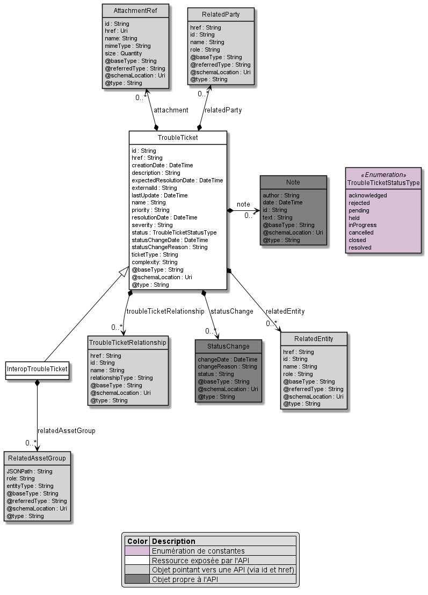

# API Ticketing Unifié

## Sommaire

- [Modèle](#user-content-ticketing-model)
- [Cycle de vie / Processus](#user-content-ticketing-lifecycle)
- [Appels API](#user-content-ticketing-sequence)
- [RGs fonctionnelles](#user-content-ticketing-rg)
- [Exemples de requêtes / réponses](#user-content-ticketing-samples)

### Modèle de données <a href="#user-content-api-ticketing-model" id="ticketing-model">#</a>

### Cycle de vie <a href="#user-content-ticketing-lifecycle" id="ticketing-lifecycle">#</a>

### Séquence d'appels API <a href="#user-content-ticketing-sequence" id="ticketing-sequence">#</a>

### RGs fonctionnelles <a href="#user-content-ticketing-rg" id="ticketing-rg">#</a>

---
**TODO**

---

### Exemples de requêtes / réponses <a href="#user-content-ticketing-samples" id="ticketing-samples">#</a>

---
**TODO**

---
