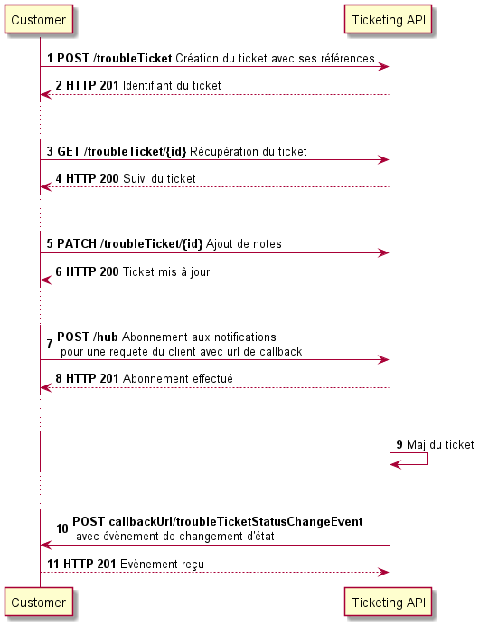

# API Ticketing Unifiée

## Sommaire

- [Modèle](#user-content-ticketing-model)
- [Cycle de vie / Processus](#user-content-ticketing-lifecycle)
- [Séquence d'appels sur cette API](#user-content-ticketing-sequence)
- [Séquence d'appels avec plusieurs API](#user-content-ticketing-multi-api-sequence)
- [RGs fonctionnelles](#user-content-ticketing-rg)
- [Exemples de requêtes / réponses](#user-content-ticketing-samples)
- [Collection Postman](#user-content-ticketing-postman)

### Modèle de données <a href="#user-content-api-ticketing-model" id="ticketing-model">#</a>


### Cycle de vie <a href="#user-content-ticketing-lifecycle" id="ticketing-lifecycle">#</a>


### Séquence d'appels sur cette API <a href="#user-content-ticketing-sequence" id="ticketing-sequence">#</a>



### Séquence d'appels avec plusieurs API <a href="#user-content-ticketing-multi-api-sequence" id="ticketing-multi-api-sequence">#</a>


### RGs fonctionnelles <a href="#user-content-ticketing-rg" id="ticketing-rg">#</a>

#### Types de Tickets 

Les types de ticket suivants sont acceptés dans cette implémentation interop de l'API Ticketing :

*Anomalie* :
 - ```AnomalieAdresse.modification``` : Modification d'adresses de l'IPE
 - ```AnomalieAdresse.creation``` : Création d'adresses dans le fichier IPE
 - ```AnomalieAdresse.creationImmeubleNeuf``` : Création d'adresses pour immeubles neufs
 - ```AnomalieAdresse.demandeInformations``` : Demande d'informations supplémentaires pour une adresse
 - ```AnomalieAdresse.nonRespectProtocole``` : Non respect du protocole CSV dans les fichiers IPE.

---
**NOTE**

Cette Liste est non exhaustive, et peut être complétée en fonction des cas d'usage supportés.
Cette liste n'est donc pas un enum dans le swagger.

---

#### Type de relations entre les tickets

Trois types de relations sont supportés par cette API :

- ```doublon``` : multiple déclaration de tickets. A utiliser lors de la cloture du ou des tickets en doublon.
- ```référence``` : ex réouverture d'un ticket. A utiliser dans un nouveau ticket pour référencer un ticket cloturé à tort.
- ```regroupe``` : décrit une hiérarchie de ticket. Un ticket parent, et N tickets enfants.

---
**NOTE**

Cette Liste est non exhaustive, et peut être complétée en fonction des cas d'usage supportés.
Cette liste n'est donc pas un enum dans le swagger.

---

### Exemples de requêtes / réponses <a href="#user-content-ticketing-samples" id="ticketing-samples">#</a>

#### Création d'un ticket simple avec une pièce jointe seulement

##### Requête

``` json
POST https://serverRoot/troubleTicket/v1
Content-Type: application/json

{
    "description": "description du ticket",
    "ticketType": "AnomalieAdresse.demandeInformations",
    "severity": "mineur",
    "name": "Demande d'infos sur l'adresse 01",
    "attachment": [
        {
            "id": "monIdPj",
            "href": "https://serverRoot/attachment/v1/monIdPj",
            "@type": "AttachmentRef"
        }
    ],
    "note": [
        {
            "id": "idNote1",
            "author": "un interlocuteur sur le ticket",
            "date": "1994-07-28T08:38:35.890Z",
            "text": "Une note ajoutée lors du dépo",
            "@type": "Note"
        }
    ],
    "relatedEntity": [],
    "relatedParty": [
        {
            "id": "id auteur",
            "name": "Nom Prénom auteur",
            "role": "Créateur du ticket",
            "@referredType": "Individual",
            "@type": "RelatedParty"
        }
    ],
    "troubleTicketRelationship": [],
    "@type": "TroubleTicket"
}
```

##### Réponse

``` json
201
Content-Type: application/json

{
  "id": "idTicket",
  "href": "https://serverRoot/troubleTicket/v1/idTicket",
  "creationDate": "1961-05-23T03:50:55.667Z",
  "description": "description du ticket",
  "ticketType": "AnomalieAdresse.demandeInformations",
  "severity": "mineur",
  "lastUpdate": "1974-12-13T11:05:07.723Z",
  "name": "Demande d'infos sur l'adresse 01",
  "attachment": [
    {
      "id": "monIdPj",
      "href": "https://serverRoot/attachment/v1/monIdPj",
      "@type": "AttachmentRef"
    }
  ],
  "note": [
    {
      "id": "idNote1",
      "author": "un interlocuteur sur le ticket",
      "date": "1994-07-28T08:38:35.890Z",
      "text": "Une note ajoutée lors du dépo",
      "@type": "Note"
    }
  ],
  "relatedEntity": [],
  "relatedParty": [
    {
      "id": "id auteur",
      "name": "Nom Prénom auteur",
      "role": "Créateur du ticket",
      "@referredType": "Individual",
      "@type": "RelatedParty"
    }
  ],
  "status": "acknowledged",
  "statusChange": [
    {
      "changeDate": "1968-12-10T00:45:49.134Z",
      "status": "acknowledged",
      "@type": "StatusChange"
    }
  ],
  "troubleTicketRelationship": [],
  "@type": "TroubleTicket"
}

```

#### Récupération d'un ticket

##### Requête

``` json
GET https://serverRoot/troubleTicket/v1/idTicket
Accept: application/json
```

##### Réponse

``` json
200
Content-Type: application/json

{
  "id": "idTicket",
  "href": "https://serverRoot/troubleTicket/v1/idTicket",
  "creationDate": "1961-05-23T03:50:55.667Z",
  "description": "description du ticket",
  "ticketType": "AnomalieAdresse.demandeInformations",
  "severity": "mineur",
  "lastUpdate": "1974-12-13T11:05:07.723Z",
  "name": "Demande d'infos sur l'adresse 01",
  "attachment": [
    {
      "id": "monIdPj",
      "href": "https://serverRoot/attachment/v1/monIdPj",
      "@type": "AttachmentRef"
    }
  ],
  "note": [
    {
      "id": "idNote1",
      "author": "un interlocuteur sur le ticket",
      "date": "1994-07-28T08:38:35.890Z",
      "text": "Une note ajoutée lors du dépo",
      "@type": "Note"
    }
  ],
  "relatedEntity": [],
  "relatedParty": [
    {
      "id": "id auteur",
      "name": "Nom Prénom auteur",
      "role": "Créateur du ticket",
      "@referredType": "Individual",
      "@type": "RelatedParty"
    }
  ],
  "status": "acknowledged",
  "statusChange": [
    {
      "changeDate": "1968-12-10T00:45:49.134Z",
      "status": "acknowledged",
      "@type": "StatusChange"
    }
  ],
  "troubleTicketRelationship": [],
  "@type": "TroubleTicket"
}
```

#### Modification d'un ticket

##### Requête

``` json
PATCH https://serverRoot/troubleTicket/v1/idTicket
Content-Type: merge-patch+json

{
  "severity": "majeur",
  "note": [
    {
      "id": "idNote1",
      "author": "un interlocuteur sur le ticket",
      "date": "1994-07-28T08:38:35.890Z",
      "text": "Une note ajoutée lors du dépo",
      "@type": "Note"
    },
    {
      "id": "idNote2",
      "author": "un autre acteur sur le ticket",
      "date": "2004-07-28T08:38:35.890Z",
      "text": "Une seconde note décrivant l'escalade",
      "@type": "Note"
    }
  ],
  "@type": "TroubleTicket"
}
```

##### Réponse

``` json
200
Content-Type: application/json

{
  "id": "idTicket",
  "href": "https://serverRoot/troubleTicket/v1/idTicket",
  "creationDate": "1961-05-23T03:50:55.667Z",
  "description": "description du ticket",
  "ticketType": "AnomalieAdresse.demandeInformations",
  "severity": "majeur",
  "lastUpdate": "1974-12-13T11:05:07.723Z",
  "name": "Demande d'infos sur l'adresse 01",
  "attachment": [
    {
      "id": "monIdPj",
      "href": "https://serverRoot/attachment/v1/monIdPj",
      "@type": "AttachmentRef"
    }
  ],
  "note": [
    {
      "id": "idNote1",
      "author": "un interlocuteur sur le ticket",
      "date": "1994-07-28T08:38:35.890Z",
      "text": "Une note ajoutée lors du dépo",
      "@type": "Note"
    },
    {
      "id": "idNote2",
      "author": "un autre acteur sur le ticket",
      "date": "2004-07-28T08:38:35.890Z",
      "text": "Une seconde note",
      "@type": "Note"
    }
  ],
  "relatedEntity": [],
  "relatedParty": [
    {
      "id": "id auteur",
      "name": "Nom Prénom auteur",
      "role": "Créateur du ticket",
      "@referredType": "Individual",
      "@type": "RelatedParty"
    }
  ],
  "status": "acknowledged",
  "statusChange": [
    {
      "changeDate": "1968-12-10T00:45:49.134Z",
      "status": "acknowledged",
      "@type": "StatusChange"
    }
  ],
  "troubleTicketRelationship": [],
  "@type": "TroubleTicket"
}
```

### Collection Postman <a href="#user-content-api-ticketing-postman" id="ticketing-postman">#</a>

---
**NOTE**

Mettre à disposition une collection Postman pour faciliter les tests.

---
